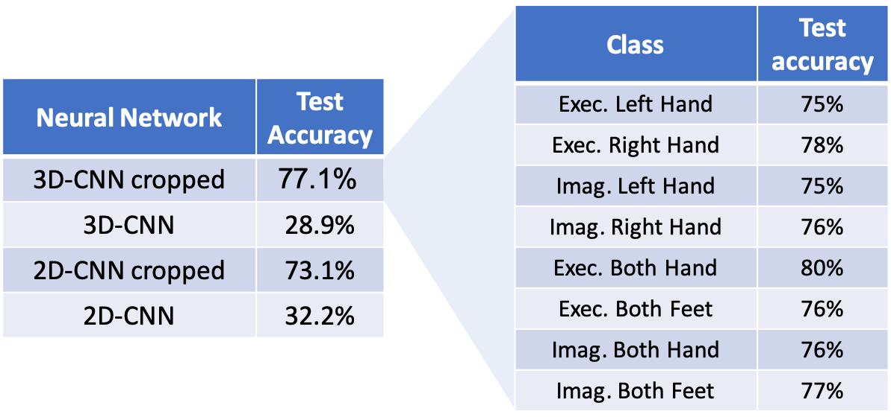

# MLcourseProject - Deep Learning Your Brain
## Classification of Movement Execution and Imagination using EEG Signals
This repository is for the Advanced Topics in ML project Spring Semester 2019.

## Group members: 
Tim Fischer, Özhan Özen, Joaquin Penalver-Andres

## Project Description:
The project will focus on classification of movement imagination and movement tasks using EEG signals. 

It has been proven that the mental planning or execution of different movements, produces different neuronal footprints. These footprints can be detected by means of an EEG recording device. The goal of this project is to classify different movements that subjects may think of or execute. 

## Report
Please note that the report.html (which is basically the export of notebook) is under the folder ProjectCode. This readme file has almost the same content.

# EEG

# Resources
## Dataset

We will base our project on an existing dataset (link: https://www.physionet.org/physiobank/database/eegmmidb/#experimental-protocol ). 

The physionet dataset contains the following classes, with 109 subjects and 64 EGG Channels (Subjects 88, 92 and 100 have overlapping events. Please exclude these subjects).

LABELS	|	DESCRIPTION
------------------------------
0 	|	Baseline, eyes open           
1 	|	Baseline, eyes closed         
2 	|	Motor execution: Left Hand           
3 	|	Motor execution: Right Hand          
4 	|	Motor imagery: Left Hand           
5 	|	Motor imagery: Right Hand          
6 	|	Motor execution: Both Hands          
7 	|	Motor execution: Both Feet           
8 	|	Motor Im: Both Hands          
9 	|	Motor imagery: Both Feet           

We have chosen to include 8 classes (baselines are excluded) for classification. 

## Tools Used

- Pytorch (For NN training)
- MNE python (For downloading/loading eeg data and creating epochs)
- Many other basic python modules for data processing
- The final test were done on a Ubuntu with two GPU
- Tensorflow (for tensorboard visualization)

        To run the TensorBoard, open a new terminal, go to the ProjectCode folder and run the command `$ tensorboard --logdir=./logs --port=6006`. Then, open http://localhost:6006/ on your web browser. If you have logs in your log dir, you will see nice graphs ;)

        (logdir should point to the log directory of your created logs)

        Logs can be created by calling write_logs_for_tensorboard() -> Feel free to modify, extend this function or add more tensorboard functions for further analysis of network performance.

## Literature Used or Inspired:

[1] Zhang, D., Yao, L., Wang, S., Chen, K., Yang, Z., & Benatallah,B. (2018, June). Fuzzy integral optimization with deep q-network for eeg-based intention recognition. In Pacific-Asia Conference on Knowledge Discovery and Data Mining (pp. 156-168). Springer, Cham.
https://github.com/dalinzhang/Cascade-Parallel/

[2] Schirrmeister, R. T., Springenberg, J. T., Fiederer, L. D. J., Glasstetter, M., Eggensperger, K., Tangermann, M., ... & Ball, T. (2017). Deep learning with convolutional neural networks for EEG decoding and visualization. Human brain mapping, 38(11), 5391-5420.

[3] Yannick, R., Hubert, B., Isabela, A., Alexandre, G., & Jocelyn, F. (2019). Deep learning-based electroencephalography analysis: a systematic review. arXiv preprint arXiv:1901.05498.

[4] Lawhern, V. J., Solon, A. J., Waytowich, N. R., Gordon, S. M., Hung, C. P., & Lance, B. J. (2018). EEGNet: a compact convolutional neural network for EEG-based brain–computer interfaces. Journal of neural engineering, 15(5), 056013.
https://github.com/vlawhern/arl-eegmodels
https://github.com/aliasvishnu/EEGNet

[5] https://robintibor.github.io/braindecode/

[6] https://martinos.org/mne/stable/auto_examples/decoding/plot_decoding_csp_eeg.html#sphx-glr-auto-examples-decoding-plot-decoding-csp-eeg-py

# Neural Networks and Training:

## Pre-processing

- The epochs are taken to cover 2s on movement (trigger) offset with 160 samples per second. 
- Each epoch data are normalized to have zero mean and standard deviation of 1.
- Augmentation of data with gaussian noise and inpainting-like data removal for regularization are tried (both in time and channel axis), however, we could not detect significant difference.
- 20 subjects were included, with 8 classes (no baseline).
- Cropping the time axis in small windows (of 10 samples) was suggested in literature [1], we have followed the suggestion. Each network is trained with and without this technique.
- For 3D CNN, the 64 channels are mapped to their locations in the head as a 2D grid (11x10). In order to make this location information a rectangle, zeros are added where there is no electrode on the grid [1].
- Eventually the data shape were (nEpochs,nChannels,nSamples), (nEpochs,nChannelsX,nChannelsY,nSamples), (nEpochs*nWindows,nChannels,nSamples) or (nEpochs*nWindows,nChannelsX,nChannelsY,nSamples) depending on whether the time axis is cropped or not and whether it was 2D or 3D CNN.

## Neural Networks Trained

### 1) 3D CNN (The network is almost the same as in [1])
- Layer 1 -- (32x1x11x10x10--cropped) or (32x1x11x10x320--non_cropped) + ExpoRU (CELU) + BatchNorm
- Layer 2 -- (64x1x11x10x10--cropped) or (64x1x11x10x320--non_cropped) + ExpoRU (CELU) + BatchNorm
- Layer 3 -- (128x1x11x10x10--cropped) or (128x1x11x10x320--non_cropped) + ExpoRU (CELU) + BatchNorm
- Layer 4 -- (Flatten fully connected Linear, Droput=0.5) 

    #### Note: All the kernel sizes were (3,3,3) with stride 1, and padding such that there were no reduction on the size.

### 2) 2D CNN (similar to the first network, but for 1D channel grid)

- Layer 1 -- (32x1x64x10--cropped) or (32x1x64x320--non_cropped) + ExpoRU (CELU) + BatchNorm
- Layer 2 -- (64x1x64x10--cropped) or (64x1x64x320--non_cropped) + ExpoRU (CELU) + BatchNorm
- Layer 3 -- (128x1x64x10--cropped) or (128x1x64x320--non_cropped) + ExpoRU (CELU) + BatchNorm
- Layer 4 -- (Flatten fully connected Linear, Droput=0.5) 

    #### Note: All the kernel sizes were (7,3) with stride 1, and padding such that there were no reduction on the size.

### For all the trainings, ADAM optimizer (lr:1e-3, weight decay:1e-4, scheduler with 20 steps and gamma 0.5), and Cross Entropy Loss (with sigmoid activation in the output) are used. Batch size was either 128 or 256.

# Results

The accuracy on the test sets for both CNNs with both cropped and non-cropped (of time axis) epochs are below. The in-class accuracy on the right is given for 3D-CNN cropped.

As you see, cropping the time axis in time windows (of 10 samples) makes a huge difference.

An explanation of Schirrmeister et al. (2017) in arXiv:1703.05051v5 states that "cropping has the aim to force the ConvNet into using features that are present in all crops of the trial, since the ConvNet can no longer use the differences between crops and the global  temporal structure." 

The training progress for accuracy and loss for cropped epochs are below.

The training progress for accuracy and loss for non-cropped epochs are below. You could see the huge overfitting.

# Discussion

From the results, we see a huge benefit of using cropped 10 sample 
windows as input. This was mainly suggested in literature (and using sizes of 10 samples [1]). Doing this, instead of taking all the recording as a single window results in a trade-off, which seemed like a good one for our project. When we crop small windows of the data, we make the network focus on repeating (or consistent) local temporal features such as the frequency of the signals. On the other side, we loose the global temporal changes. For example, if the it is common that with one of the tasks (labels), there is a systematic drift over time (320 time points), we will not be able to detect this. However, for our example it seemed like the most of the representative information was contained in this small windows since this time cropping increased the network classification accuracy a lot.

There are also other approaches in the literature, like in [1], that combines the CNNs (local spatio-temporal features) and RNNs (to capture global temporal changes). These removes the trade-off and benefit from both ways. Due to the lack of time, we could not explore these (no RNN at all). Our project scope had to be limited to re-exploring the CNN structure used in [1], making a 2D version of it, and classifying on 8 labels (all except baseline) except 5.

Between 2D and 3D CNNs, we see that 3DD performs better (cropped versions). This is consistent with the literature and intuitive. Since the electrodes are having a layout which physiologically makes sense in 3D version (the way they are attached to the head), the layout brings additional information, and this increases the accuracy.

We have implemented and tried different augmenting the data with gaussian noise, and dropping some parts of the information similar to inpainting. However we could not detect a significant benefit. Furthermore, since we had always the opportunity of using data from more subjects (we have used 20 out of 109), data augmentation was not our focus.

# Future Works

What we think could be future work that may benefit the project are:

- Utilizing RNNs with CNNs to include the global temporal change information as it was done in [1].

- Making adaptive kernel sizes for CNN (and for cropping windows sizes) to extract optimal frequency features.

- Using autoencoders to extract recurring patterns, and using these to increase classification accuracy.

- Using Transfer learning to utilize this dataset on other EEG applications.

# Code: How-to
- In order to run the project, you need to open the 'Main' jupyter notebook and run it from top to bottom.

- All parameters necessary for adapting the classification can be modified inside the config/<myconfig.py> files. To store specific settings, just add a class to myconfig.py, inheriting from DefaultConfig.

- Put your configs which shall be evaluated inside the list_of_configs in the myconfig.py module.
	
- Inside the main.py: Select your config via myList = myconfig.list_of_configs

- In case of supplementary optimizers or nn, please add them to the optimizers.py or neural_nets package. Adapt the optimizer_list or nn_list (+nn_models_getter.py) the  in the defaultconifg.py respectively.

## Example config file to run any NN implemented/tested

#### Config class name to include in the list at the bottom.
    class Config3DCNN_NOTCropped(DefaultConfig):
        verbose = 'CRITICAL'
        
        config_name = '3D CNN'
        config_remark = '3D CNN'
   
   #### Number of subjects.
    nSubj = 20 
    selected_subjects = selected_subjects[:nSubj]
    
   #### Selection of the network and optimizer, these names have to be in .py files.
    nn_list = ['ConvNet3D']  # Extend if you want more. Add them in the nn_models_getter.py module
    nn_selection_idx = 0
    optimizer_list = ['Adam']  # Extend if you want more. Add them in the optimizers.py module
    optimizer_selection_idx = 0  # Idx corresponds to entry optimizer_list (find below)
    learning_rate = 1e-3
    weight_decay = 1e-4
    
   #### Setting up a scheduler for learning rate.
    scheduler = True  
    schStepSize = 20
    schGamma = 0.5
    
   #### Number of epochs and early stopping settings.
    num_of_epochs = 50
    batch_size = 128
    use_early_stopping = True
    es_patience = num_of_epochs
    
   #### Normalization/augmentation settings
    normalize = True
    augment_with_gauss_noise = False
    augmentation_factor = 2
    augment_std_gauss = 0.2
    dropOut = False
    dropOutChOnly = False
    dropOutTimeOnly = False
    dropOutTilePerc = 0.5
    dropOutTimeTile = 40
    dropOutChannelTile = 8
    
   #### Epoch Settings
    time_before_event_s = 0.0  # Epochsize parameter: Start time before event.
    time_after_event_s = 2.0  # Epochsize parameter: Time after event.
    downSample = 1
    
   #### To make number of data points dividable with 10
    show_events_distribution = False
    removeLastData = True
    
   #### To make channel dimension 2d, or cropping the time axis.
    Elec2D = True
    wSize = 10
    wCropped = False
    
    
#### All the classes in this list will be trained.
    list_of_configs = [Config3DCNN_Cropped]
